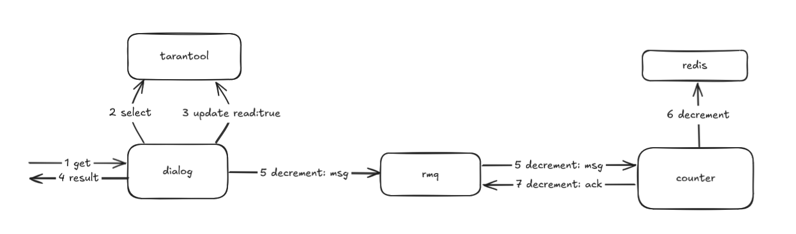
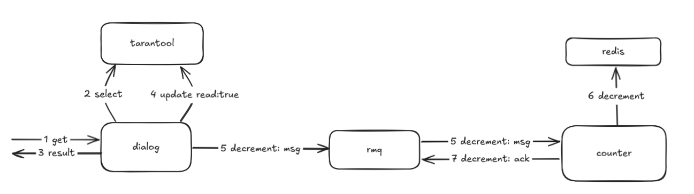
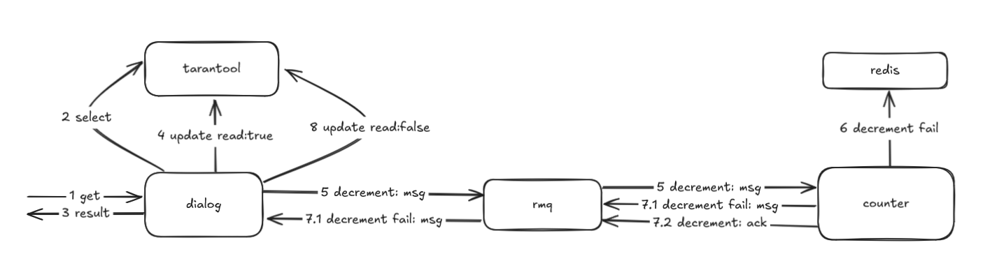

# Сервис счетчиков

## Сервис счётчиков
Дано:
- большая нагрузка на чтение
- счётчик представляет из себя ключ диалога для пользователя со значением в виде числа непрочитанных сообщений

Решение: используем redis, т.к. он уже развёрнут и работать с ним из кода очень просто

## Обеспечение консистентности
Используем паттерн SAGA с хореографией: каждый сервис будет знать все нужные ему кусочки распределённого процесса. Для этого требуется связать сервисы между собой -- тут нам отлично подойдут очереди в уже развёрнутом rabbitmq.

Модель сообщения для обмена:
```golang
type Operation struct {
	FromUserID int64   `json:"from_user_id"`
	ToUserID   int64   `json:"to_user_id"`
	Operation  string  `json:"operation"`
	IDs        []int64 `json:"ids"`
}
```

Где:
- FromUserID -- часть ключа
- ToUserID -- часть ключа
- Operation -- операция, которую должен выполнить следующий сервис
- IDs -- массив ID сообщений, которые участвуют в распределённой операции

И сервис счётчиков, и сервис диалогов подключены каждый к своей очереди горутиной, выполняющейся в фоне:
- [counter-api/main.go:23](../counter-api/main.go)
- [dialog-api/main.go:23](../dialog-api/main.go)

Визуально "танец" с инкрементом счётчика выглядит следующим образом:

1. Клиент постит сообщение в диалог.
2. Сервис диалогов пишет строку в тарантул.
3. Сервис диалогов отправляет в очередь DialogCounterIn сообщение о том, что нужно увеличить счётчик, в массиве IDs лишь один ID нового сообщения. Сервис счётчиков получает сообщение из очереди.
4. Сервис счётчиков увеличивает счётчик на длину массива IDs -- на единицу.
5. Сервис счётчиков подтверждает сообщение, полученное на шаге 3.

В данном случае нет необходимости в излишней сложности с компенсирующими и поворотными транзакциями, т.к. при падении на шаге 4 сервис счётчиков прервёт чтение rabbitmq, не подтвердив получения сообщений, что приведёт к дальнейшему их автоматическому перепрочтению. В итоге, как только redis сможет принять обновление, из очереди уйдет "задание" на инкремент конкретного счётчика.

"Танец" с декрементом сложнее. Успешный вариант:

1. Клиент запрашивает сообщения из диалога.
2. Сервис диалогов идёт в тарантул за сообщениями.
3. Клиенту отдаётся json со списком сообщений.
4. Сервис диалогов проходит по этому же списку, для всех сообщений с флажком read: false собирает ID в массив, в конце выполняет по ID из этого массива update в тарантуле.
5. Сервис диалогов отправляет в очередь DialogCounterIn сообщение о том, что нужно уменьшить счётчик, в IDs массив ID из пункта выше. Сервис счётчиков получает сообщение из очереди.
6. Сервис счётчиков уменьшает счётчик на длину массива IDs -- на число сообщений, у которых был read: false.
7. Сервис счётчиков подтверждает сообщение, полученное на шаге 5.

Неуспешный вариант:

1-5. Аналогично успешному варианту выше.
6. Сервис счётчиков не может сделать декремент в редиске.
7.1. Сервис счётчиков отправляет в очередь DialogCounterOut сообщение о том, что декремент не декремент, в IDs массив ID из пункта 4. Сервис диалогов получает сообщение из очереди.
7.2. Сервис счётчиков подтверждает сообщение, полученное на шаге 5.
8. Сервис диалогов выполняет по ID из этого массива обратый update в тарантуле.

В данном случае:
- 4 это компенсируемая транзакция
- 6 это поворотная транзакция
- 8 это компенсирующая транзакция

В случае отказа редиски, счётчик не будет уменьшен и в тарантул вернётся read: false для тех же ID, которые изначально были отправлены в сервис счётчиков. Пользователь при этом уйдёт со списком сообщений, т.к. ценность счётчика непрочитанных сообщений сильно ниже возможности вести диалог. Когда редиска вернётся, то ситуация останется такой же, как если бы пользователь не запрашивал сообщений.

## Микро тест
Успешный проход:
```bash
# Авторизуемся пользователем 1
ednefed@nfd-vm-ubuntu $ token1=$(curl -s http://localhost:8080/login -d '{"id": 1, "password": "12345678"}' | jq -r .token)
# Авторизуемся пользователем 2
ednefed@nfd-vm-ubuntu $ token2=$(curl -s http://localhost:8080/login -d '{"id": 2, "password": "12345678"}' | jq -r .token)
# Пользователем 1 получим диалог с пользователем 2 -- там ничего нет
ednefed@nfd-vm-ubuntu $ curl -s http://localhost:8080/dialog/2 -H "Authorization: Bearer $token1" | jq -c
[]
# Пользователем 1 отправим пару сообщений пользователю 2
ednefed@nfd-vm-ubuntu $ curl -s http://localhost:8080/dialog/2 -d '{"message": "qweasdzxc"}' -H "Authorization: Bearer $token1" | jq -c
{"message":"Message sent"}
ednefed@nfd-vm-ubuntu $ curl -s http://localhost:8080/dialog/2 -d '{"message": "qweasdzxc"}' -H "Authorization: Bearer $token1" | jq -c
{"message":"Message sent"}
# Пользователем 1 проверим счётчик непрочитанных -- там 0, т.к. пользователь 2 ничего не писал
ednefed@nfd-vm-ubuntu $ curl -s http://localhost:8082/api/v2/counter/2 -H "Authorization: Bearer $token1" | jq -c
{"from_user_id":2,"to_user_id":1,"unread":0}
# Пользователем 1 получим диалог с пользователем 2 -- там два сообщения, отправленных выше
ednefed@nfd-vm-ubuntu $ curl -s http://localhost:8080/dialog/2 -H "Authorization: Bearer $token1" | jq -c
[{"from_user_id":1,"to_user_id":2,"message":"qweasdzxc","created_at":"2024-10-23T21:04:44Z"}
,{"from_user_id":1,"to_user_id":2,"message":"qweasdzxc","created_at":"2024-10-23T21:04:42Z"}]
# Пользователем 2 проверим счётчик непрочитанных -- там 2 сообщения
ednefed@nfd-vm-ubuntu $ curl -s http://localhost:8082/api/v2/counter/1 -H "Authorization: Bearer $token2" | jq -c
{"from_user_id":1,"to_user_id":2,"unread":2}
# Пользователем 2 получим диалог с пользователем 1 -- там те же самые два сообщения, отправленные выше
ednefed@nfd-vm-ubuntu $ curl -s http://localhost:8080/dialog/1 -H "Authorization: Bearer $token2" | jq -c
[{"from_user_id":1,"to_user_id":2,"message":"qweasdzxc","created_at":"2024-10-23T21:04:44Z"}
,{"from_user_id":1,"to_user_id":2,"message":"qweasdzxc","created_at":"2024-10-23T21:04:42Z"}]
# Пользователем 2 проверим счётчик непрочитанных -- там 0, т.к. мы только что их прочитали
ednefed@nfd-vm-ubuntu $ curl -s http://localhost:8082/api/v2/counter/1 -H "Authorization: Bearer $token2" | jq -c
{"from_user_id":1,"to_user_id":2,"unread":0}
```
Проход с отвалом редиски посередине:
```bash
# Пользователем 1 отправим одно сообщение пользователю 2
ednefed@nfd-vm-ubuntu $ curl -s http://localhost:8080/dialog/2 -d '{"message": "qweasdzxc"}' -H "Authorization: Bearer $token1" | jq -c
{"message":"Message sent"}
# Пользователем 2 проверим счётчик непрочитанных -- там 1 сообщение
ednefed@nfd-vm-ubuntu $ curl -s http://localhost:8082/api/v2/counter/1 -H "Authorization: Bearer $token2" | jq -c
{"from_user_id":1,"to_user_id":2,"unread":1}
# Убьём редиску
# Пользователем 2 проверим счётчик непрочитанных -- получаем в лицо 500 от сервиса счётчиков 
ednefed@nfd-vm-ubuntu $ curl -s http://localhost:8082/api/v2/counter/1 -H "Authorization: Bearer $token2" | jq -c
{"message":"Server error"}
# Пользователем 2 получим диалог с пользователем 1 -- там два сообщения из первого прохода плюс одно новое выше
ednefed@nfd-vm-ubuntu $ curl -s http://localhost:8080/dialog/1 -H "Authorization: Bearer $token2" | jq -c
[{"from_user_id":1,"to_user_id":2,"message":"qweasdzxc","created_at":"2024-10-23T21:11:03Z"}
,{"from_user_id":1,"to_user_id":2,"message":"qweasdzxc","created_at":"2024-10-23T21:04:44Z"}
,{"from_user_id":1,"to_user_id":2,"message":"qweasdzxc","created_at":"2024-10-23T21:04:42Z"}]
# Запустим редиску
# Пользователем 2 проверим счётчик непрочитанных -- там видим 1 сообщение
ednefed@nfd-vm-ubuntu $ curl -s http://localhost:8082/api/v2/counter/1 -H "Authorization: Bearer $token2" | jq -c
{"from_user_id":1,"to_user_id":2,"unread":1}
# Пользователем 2 получим диалог с пользователем 1 -- там все те же три сообщения
ednefed@nfd-vm-ubuntu $ curl -s http://localhost:8080/dialog/1 -H "Authorization: Bearer $token2" | jq -c
[{"from_user_id":1,"to_user_id":2,"message":"qweasdzxc","created_at":"2024-10-23T21:11:03Z"}
,{"from_user_id":1,"to_user_id":2,"message":"qweasdzxc","created_at":"2024-10-23T21:04:44Z"}
,{"from_user_id":1,"to_user_id":2,"message":"qweasdzxc","created_at":"2024-10-23T21:04:42Z"}]
# Пользователем 2 проверим счётчик непрочитанных -- там 0, т.к. мы только что всё прочитали
ednefed@nfd-vm-ubuntu $ curl -s http://localhost:8082/api/v2/counter/1 -H "Authorization: Bearer $token2" | jq -c
{"from_user_id":1,"to_user_id":2,"unread":0}
```

## Вывод
Применённый паттерн вполне обеспечивает консистентность счётчика. При недоступности редиски данные между ней и тарантулом не расходятся, и пользователи по-прежнему могут писать сообщения друг другу.
Использование очереди в кролике позволяет поднять несколько экземпляров сервисов диалогов и счетчиков для обработки больших нагрузок, т.к. кролик распределяет сообщения между несколькими консьюмерами одной очереди по принципу round-robin.
