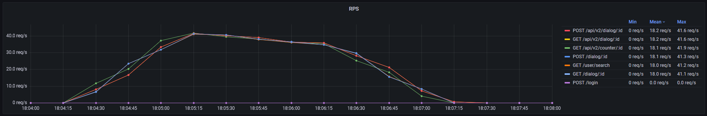
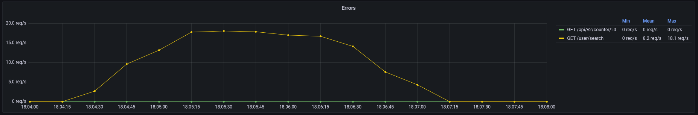
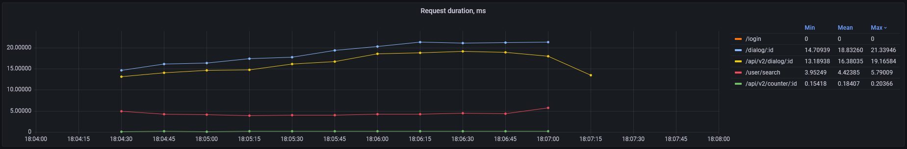
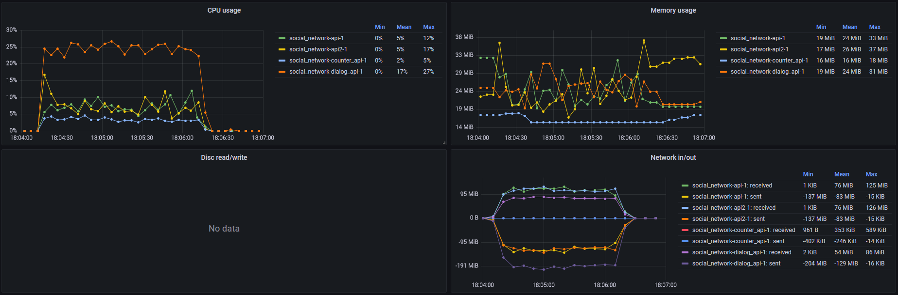
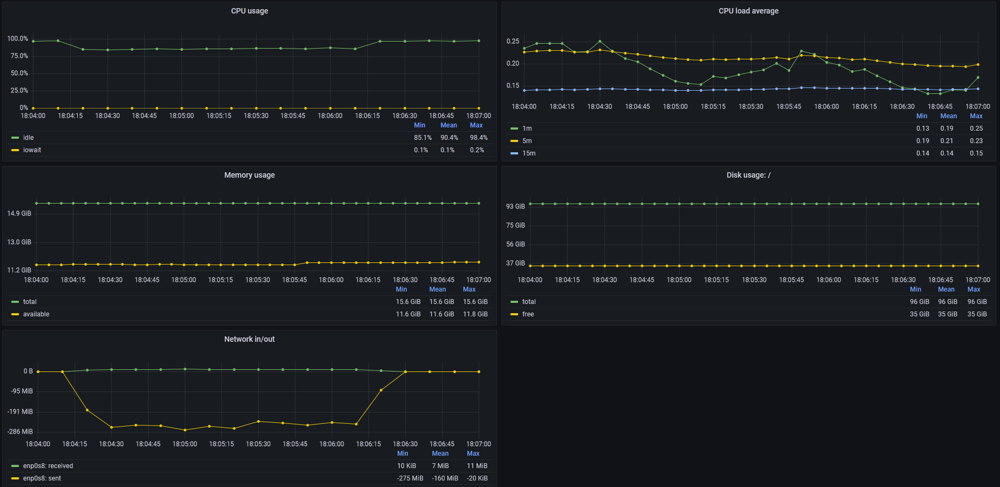

# Мониторинг
## Zabbix 
Одной из целей задания явялется: развернуть zabbix и начать писать в zabbix технические метрики сервера с сервисом чатов. Что ж, я считаю эту часть домашнего задания нецелесообразной по двум причинам.

Первая причина: сам zabbix.
В современных реалиях для сбора и хранения хостовых метрик есть более оптимальные и удобные утилиты, например, telegraf. Он выигрывает у заббикса по нескольким позициям:
- агент телеграфа более прост в конфигурации, чем агент заббикса
- телеграф гораздо более гибок в части интеграции с источником метрик и хранилищем метрик за счёт большого количества плагинов (input_plugins и output_plugins), доступного "из коробки"
- телеграф позволяет использовать публично доступные хранилища метрик, например InfluxDB, с которыми отлично может взаимодействовать, например, Grafana для визуализации метрик

В итоге поднять полноценный сбор метрик с хостов, приложений и прочих сервисов с помощью телеграфа и, например, InfluxDB и Grafana, гораздо проще, чем с помощью zabbix.

Вторая причина: домашнее задание №2 (Производительность индексов) и №3 (Репликация).
В рамках них мы уже развернули систему сбора хостовых метрик для нагрузочных тестоа JMeter на основе Telegraf и InfluxDB. Ввиду этого поднять рядом zabbix просто ради zabbix выглядит не особо целесообразным.

## Сбор технических метрик
Реализован в виде агента telegraf, собирающего метрики как с хоста docker, так и с контейнеров docker на нём.

## Сбор бизнес-метрик
Реализован на каждом из сервисов API в виде middleware, публикующем метрики фреймворка gin в формате prometheus. Для примера см. [dialog-api/main.go:33](../dialog-api/main.go). В числе собираемых метрик есть:
- количество обработанных запросов (gin_uri_request_total), в том числе и с ошибками
- гистограмма длительности обрабатываемых запросов (gin_request_duration_sum и gin_request_duration_count), позволяющая вычислить среднее время длительности запроса к сервису

## Дашборды в Grafana
В рамках домашнего задания для демонстрации сбора метрик проведён небольшой нагрузочный тест. Во время него два треда JMeter имитируют работы двух пользователей, каждый из которых выполнет единоразово логин в систему, после чего случайно дёргает методы GET /user/search, POST/dialog/:id, GET /api/v2/counter/:id и /dialog/:id.
График бизнес-метрик сервисов выглядит следующим образом:

Тот самый метод RED:
- rate -- RPS, запросы в секунду
- errors -- запросы с ошибкой в секунду (в рамках теста используется )
- duration -- среднее время длительности обработки запроса сервером в секунду

Метрики контейнеров:

И метрки хоста:

## Вывод
Был организован сбор технических метрик и бизнес-метрик по принципу RED. В Grafana организован соответствуюущий дашборд.
