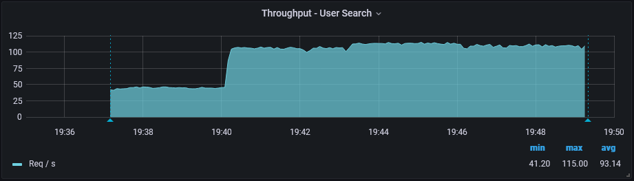
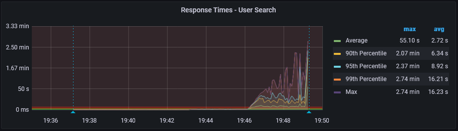
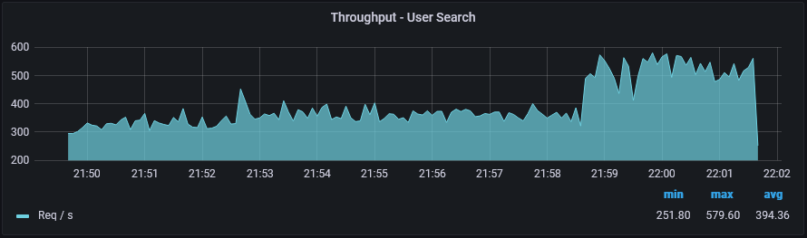
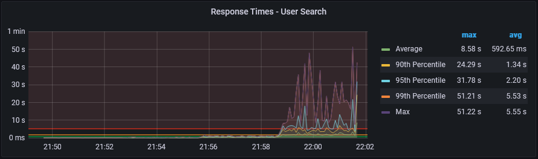

# Описание "стенда"
Всё развёрнуто на одной ВМ (8 ЦПУ, 16 ГБ ОЗУ) в docker. Контейнеры ограничены по ресурсу процессора (см. docker-compose.yaml), в частности:
- postgresql выделено 6 ядер
- сервису api выделено 1 ядро

# План тестирования
JMeter будет работать в 4 этапа:
- 1 пользователь длительностью 3 минуты
- 10 пользователей длительностью 3 минуты, разон 10 секунд
- 100 пользователей длительностью 3 минуты, разон 10 секунд
- 1000 пользователей длительностью 3 минуты, разон 10 секунд

Требуемая в задании latency, как мне кажется, не совсем подходящая метрика, т.к. интересует именно длительность всего запроса, а не только первоначальный отклик от сервера. Поэтому на графиках вместо неё будет response time.

# Индекс
Для оптимизации выполнения запроса LIKE 'Prefix%' в PostgreSQL подойдёт обычный B-tree индекс с указанием соответствующего класса операторов для индексируемых полей. В конкретном случае это два поля varchar(255), поэтому класс операторов для них -- varchar_pattern_ops.

Запрос:
```sql
create index users_first_last_names on public.users (first_name varchar_pattern_ops, last_name varchar_pattern_ops);
```

# До индекса
Explain запроса показывает последовательное чтение таблицы:
```
Gather Merge  (cost=19340.92..19470.43 rows=1110 width=65) (actual time=33.987..36.089 rows=1388 loops=1)
  Workers Planned: 2
  Workers Launched: 2
  ->  Sort  (cost=18340.90..18342.29 rows=555 width=65) (actual time=31.311..31.330 rows=463 loops=3)
        Sort Key: id
        Sort Method: quicksort  Memory: 67kB
        Worker 0:  Sort Method: quicksort  Memory: 71kB
        Worker 1:  Sort Method: quicksort  Memory: 68kB
        ->  Parallel Seq Scan on users u  (cost=0.00..18315.60 rows=555 width=65) (actual time=9.235..31.049 rows=463 loops=3)
              Filter: (((first_name)::text ~~ 'Иван%'::text) AND ((last_name)::text ~~ 'Алекс%'::text))
              Rows Removed by Filter: 332849
Planning Time: 1.147 ms
Execution Time: 36.194 ms
```



На графике throughput видно, что прирост пропускной способности на третьем этапе практически незначителен. Response time при этом в меру нормальный. На четвёртом этапе response time превышает все разумные значения, throughput чуть ниже третьего этапа -- сервис достиг предела.

Статистка контейнеров в этот момент показывает, что postgresql потребляет все 6 из 6 доступных ему ядер ЦПУ:
```
CONTAINER ID   NAME                          CPU %     MEM USAGE / LIMIT     MEM %     NET I/O           BLOCK I/O        PIDS
4581bf5243c5   social_network-grafana-1      0.02%     46.07MiB / 15.61GiB   0.29%     13.9MB / 13.9MB   401kB / 33.9MB   16
f206cb4a3c3b   social_network-telegraf-1     0.03%     67.11MiB / 15.61GiB   0.42%     752kB / 3.84MB    0B / 457MB       15
8fece73d4a44   social_network-postgresql-1   617.01%   363.6MiB / 15.61GiB   2.27%     348MB / 33.2GB    0B / 126MB       111
6bc65961982b   social_network-influxdb-1     0.05%     30.93MiB / 15.61GiB   0.19%     7.22MB / 9.83MB   131kB / 33.9MB   21
6be8e82d71a5   social_network-api-1          27.55%    107.6MiB / 15.61GiB   0.67%     35.3GB / 53.6GB   0B / 0B          17
```

# После индекса
Explain запроса показывает использование построенного индекса для построение битовой карты (Bitmap Index Scan), после чего идёт использование этой карты для чтания таблицы (Bitmap Heap Scan):
```
Sort  (cost=4367.04..4370.37 rows=1331 width=65) (actual time=1.261..1.310 rows=1388 loops=1)
  Sort Key: id
  Sort Method: quicksort  Memory: 180kB
  ->  Bitmap Heap Scan on users u  (cost=467.23..4297.98 rows=1331 width=65) (actual time=0.348..0.950 rows=1388 loops=1)
        Filter: (((first_name)::text ~~ 'Иван%'::text) AND ((last_name)::text ~~ 'Алекс%'::text))
        Heap Blocks: exact=275
        ->  Bitmap Index Scan on users_first_last_names  (cost=0.00..466.90 rows=1326 width=0) (actual time=0.312..0.312 rows=1388 loops=1)
              Index Cond: (((first_name)::text ~>=~ 'Иван'::text) AND ((first_name)::text ~<~ 'Ивао'::text) AND ((last_name)::text ~>=~ 'Алекс'::text) AND ((last_name)::text ~<~ 'Алект'::text))
Planning Time: 1.118 ms
Execution Time: 1.411 ms
```
В сравнении с первым вариантом, "стоимость" запроса снизилась в 4-5 раз (~4350 против ~19400)



Throughput в несколько раз выше, чем в первую итерацию. Response time при максимальной нагрузке хоть и тоже высокий, но в несколько раз ниже.

Статистка контейнеров в этот момент показывает, что postgresql потребляет чуть больше 1 ядра ЦПУ из 6, а вот api целиком использует 1 из 1:
```
CONTAINER ID   NAME                          CPU %     MEM USAGE / LIMIT     MEM %     NET I/O           BLOCK I/O        PIDS
4581bf5243c5   social_network-grafana-1      0.05%     45.98MiB / 15.61GiB   0.29%     13.8MB / 13.8MB   401kB / 33.9MB   16
f206cb4a3c3b   social_network-telegraf-1     1.88%     67.26MiB / 15.61GiB   0.42%     745kB / 3.81MB    0B / 457MB       15
8fece73d4a44   social_network-postgresql-1   110.11%   313.8MiB / 15.61GiB   1.96%     339MB / 32.1GB    0B / 126MB       104
6bc65961982b   social_network-influxdb-1     0.74%     30.92MiB / 15.61GiB   0.19%     7.15MB / 9.74MB   131kB / 33.6MB   21
6be8e82d71a5   social_network-api-1          101.80%   300.5MiB / 15.61GiB   1.88%     34.1GB / 51.8GB   0B / 0B          17
```

# Вывод
Использованием индекса удалось увеличить пропускную способность сервиса и снизить нагрузку на базу данных.
