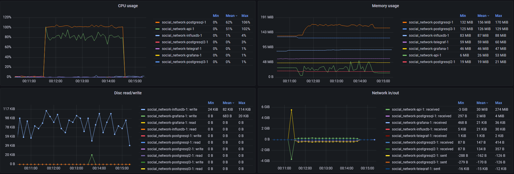
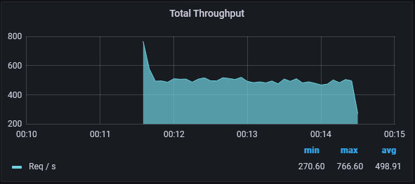
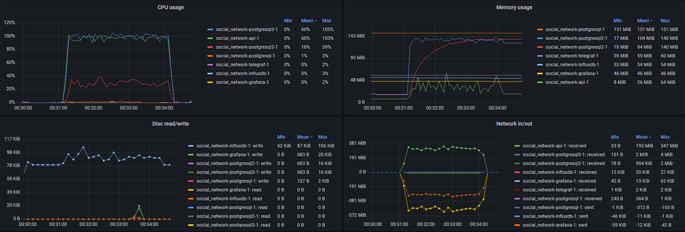
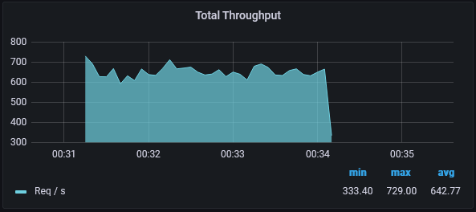

# Описание "стенда"
Всё развёрнуто на одной ВМ (8 ЦПУ, 16 ГБ ОЗУ) в docker. Контейнеры ограничены по ресурсу процессора (см. docker-compose.yaml), в частности:
- каждому postgresql выделено 1 ядро
- сервису api выделено 1 ядро
- influxdb выелено 0.5 ядра
- grafana и telegraf выделено по 0.25 ядра

# Асинхронная репликация
## Создание
Запустим сервисы, настроим асинхронную репликацию с мастера на две реплики. Сервис api работает только с мастером: в POSTGRESQL2_HOST и POSTGRESQL3_HOST указан один и тот же мастер.
postgresql-async-replication.sh создаёт пользователя replicator, добавляет для репликации запись в pg_hba.conf, включает потоковую репликацию на мастере. Далее с помощью pg_basebackup создаёт полный бэкап для первой реплики, сохраняя результат в volume для последующего использования контейнером с базой. Создаёт полный бэкап для второй реплики. Запускает реплики.
```bash
docker compose -f docker-compose.yaml build api
docker compose -f docker-compose.yaml up -d
# До запуска скрипта в базу были загружены пользователи из https://github.com/OtusTeam/highload/blob/master/homework/people.v2.csv
./scripts/homework-3/postgresql-async-replication.sh
```
postgresql-async-replication.sh выдаст статус синхронизации с мастера: два асинхронных клиента
```
 application_name | client_addr |   state   | sync_state |  sent_lsn  | replay_lsn 
------------------+-------------+-----------+------------+------------+------------
 postgresql3      | 172.20.0.3  | streaming | async      | 0/630001F8 | 0/630001F8
 postgresql2      | 172.20.0.4  | streaming | async      | 0/630001F8 | 0/630001F8
```
Jmeter (socnet.jmx), 10 тредов длительностью 3 минуты, разгон 10 секунд. 
Утилизация ресурсов до перевода запросов на реплики:

Вся нагрузка по ЦПУ, диску (увы, телеграф не снял именно чтение) и сети лежит на мастере. Всего было обратботано 91156 запросов со средней throughput 498 запросов/с:


Переключаем POSTGRESQL2_HOST и POSTGRESQL3_HOST у сервиса api на реплики, обновляем:
```bash
docker compose -f docker-compose.yaml up -d
```
Снова Jmeter (socnet.jmx), 10 тредов длительностью 3 минуты, разгон 10 секунд. 
Утилизация ресурсов после перевода запросов на реплики:

Мастер не нагружен, вместо него две реплики обрабатывают запросы. Реплика с запросами '/user/:id' потребляет в среднем 30% ЦПУ, реплика с запросами '/user/search?first_name=&last_name=' все 100%. На графике памяти видно, как реплики наполняют свои shared_buffers (до 128 МБ дефолтных), причем первая реплика (с '/user/:id') делает это более плавно (получение по первичному ключу менее затратно по памяти, чем поиск по индексу). Всего было обработано 117365 запросов со средней throughput 642 запросов/с -- на 28.7% больше:


# Синхронная репликация
## Создание
Включаем кворумный (ANY) синхронный коммит (synchronous_commit) на мастере с подтверждением от любой (ANY 1) из двух реплик.
```bash
./scripts/homework-3/postgresql-sync-replication.sh
```
postgresql-sync-replication.sh в конце выдаст статус синхронизации с мастера: два синхронных клиента в кворуме
```
 application_name | client_addr |   state   | sync_state |  sent_lsn  | replay_lsn 
------------------+-------------+-----------+------------+------------+------------
 postgresql3      | 172.20.0.3  | streaming | quorum     | 0/693FE7F0 | 0/693FE7F0
 postgresql2      | 172.20.0.4  | streaming | quorum     | 0/693FE7F0 | 0/693FE7F0
 ```

## Нагрузка и проверка потерь транзакций
План:
- даём нагрузку на запись
- убиваем мастер
- останавливаем нагрузку
- промоутим до мастера наименее отстающую реплику
- переключаем на неё вторую реплику
- сверяем последний id в таблице users с последним полученным в ходе нагрузки на вставку

Нагрузка будет в Jmeter (socnet.jmx), 1 тред длительностью 3 минуты, разгон 10 секунд.
Действия с постгресами будет делать скрипт:
```bash
./scripts/homework-3/postgresql-failover.sh
```
Последний полученный id из users в Jmeter: 1001107. Последний id из таблицы выдаст postgresql-failover.sh вместе со статусом репликации нового мастера:
```
 application_name | client_addr |   state   | sync_state |  sent_lsn  | replay_lsn 
------------------+-------------+-----------+------------+------------+------------
 postgresql2      | 172.20.0.4  | streaming | quorum     | 0/720001F0 | 0/720001F0
(1 row)

   max   
---------
 1001107
(1 row)
```
id совпадают, потерь транзакций при падении мастера при синхронной репликации не произошло.
