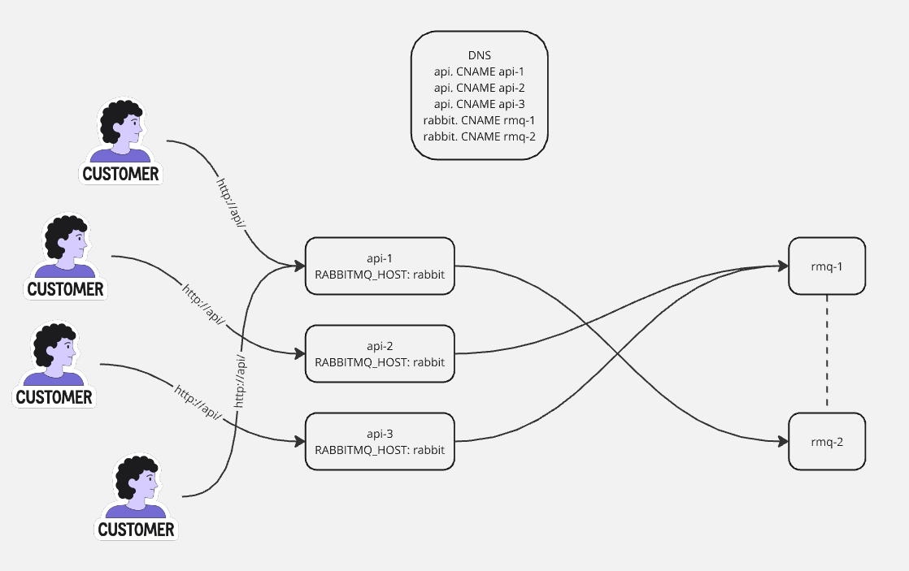

# Онлайн обновление ленты новостей
## RabbitMQ
Общая идея следующая. При создании поста оный отправляется в amq.direct эксчейндж. Direct -- потому что сообщения нужно направлять в очереди по конкретному ключу. Ключом выступает ID автора поста.
Клиентом после открытия вебсокета создаётся очередь, которая биндится на эксчейндж по Н ключам -- ID пользователей, на которые оформлена подписка. Очереди сконфигурированы как Non-Durable и Auto-Deleted -- они не будут пересозданы при падении RabbitMQ и будут автоматически удалены при отключении всех консьюмеров.

Тут есть проблема: пользователь может одновременно использовать несколько сессий с сервисом (разные устройства или вкладки в браузере), а очередь в RabbitMQ одна для всех консьюмеров. В целом, можно использовать случайно сгенерированное имя для каждой сессии, но для большего удобства используется связка ID пользователя и случайная строка. Таким образом сообщение гарантированно придёт в каждый открытый вебсокет.

## WebSocket
### Клиент
Реализован в минимальном виде в [index.html](../api/index.html). Для упрощения логики, авторизация как таковая отсутствует. Вместо неё дано поле ввода ID пользователя и кнопка, по нажатию на которую будет открыт вебсокет на /post/feed/:UserID, чтобы серверная часть могла обрабатывать подключения конкретного пользователя. JS будет добавлять сообщения из вебсокета в блок с id "output".

### Сервер
Серверная часть реализована в getNewPostsWS() в [handlers.go](../api/handlers.go). После открытия вебсокета, из БД достаётся список подписок пользователя. Нет друзей -- нет смысла в вебсокете, т.к. обновлять ленту нечем. Затем создаётся очередь и биндится на эксчейндж по ID каждого друга. После чего начиается потребление сообщений из очереди и передача их в вебсокет.

## Корректная работа сервиса вебсокетов
Достигается за счёт использования одной очереди на клиентскую сессию и биндинг на эксчейндж по ID подписок.

## Линейная масштабируемость сервиса вебсокетов
Сервис api можно размножить в любом количестве, т.к. любая одна сессия с вебсокетом будет установлена только с одним экземпляром сервиса.

## Процесс масштабирования RabbitMQ
RabbitMQ "из коробки" поддерживает кластеризацию: [Clustering Guide](https://www.rabbitmq.com/docs/clustering). Для клиентской части нет разницы, к какой ноде кластера подключаться. Имеет смысл при масштабировании сервиса вебсокетов, т.к. в текущей реализации у него одно подключение для всех взаимодействий с RabbitMQ. Одна очередь всегда привязывается к одной ноде, при этом все очереди доступны с любой из нод. Можно, к примеру, воспользоваться тем же DNS (CNAME запись) для распределения подключений между нодами кластера. В таком случае (и при нескольких репликах api):
- очереди будут равномерно распределены по кластеру, т.к. под каждый вебсокет сервис создаст свою очередь -- обращения к вебсокетам api будут распределены по репликам сервиса, в свою очередь каждая из них подключится к случайной ноде RabbitMQ;
- формирование входящих сообщений также будет распределено между всеми репликами api, значит и всеми нодами RabbitMQ.
Примерно так:

Добавление нового экземпляра в кластер сводится к обновлению конфигурации rabbitmq.conf на всех нодах и рестарту RabbitMQ. Сервис api тоже придётся рестартовать, т.к. переподключение к внешним сервисам в нём не реализовано.
