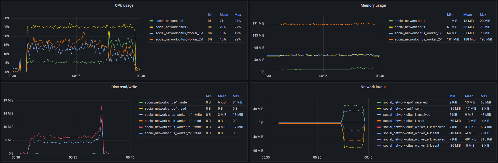
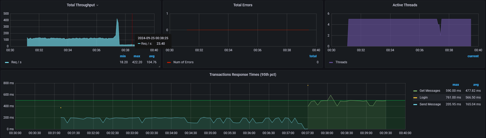
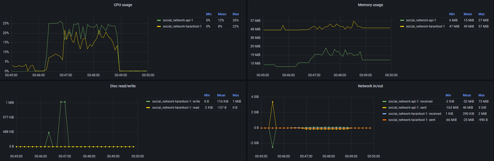
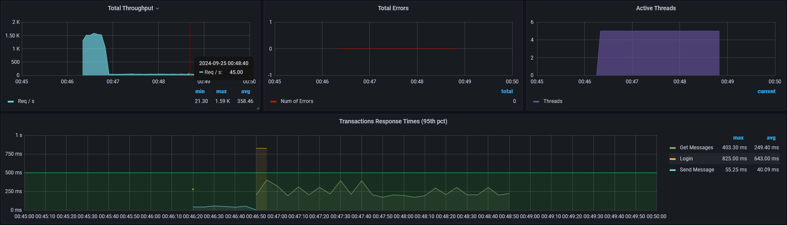

# Применение tarantool'а как хранилища
## Описание стенда
Всё развёрнуто на одной ВМ (8 ЦПУ, 16 ГБ ОЗУ) в docker. Контейнеры ограничены по ресурсу процессора (см. docker-compose.yaml) 0.25 ядра каждый.

### Tarantool
Взаимодействие с базой выполняется посредством вызова lua команд в [tarantool.go](../api/tarantool.go):
- box.space.dialogs:auto_increment() для вставки с автоинкрементом ключа
- box.space.dialogs.index.from_to:select() для выборки по индексу

## План тестирования
JMeter будет работать дважды в 2 этапа, каждый по 5 тредов (5 разных пользователей c ID от 1 до 5):
- разовый логин для получения токена, 10к вызовов эндпоинта отправки диалогового сообщения случайному пользователю из того же диапазона ID
- разовый логин для получения токена, 120 секунд чтения диалогов со случайными пользователями из того же диапазона ID

Первый запуск будет с диалогами, хранящамися в Citus. Второй -- в Tarantool. Оба раза на старте будет пустая база, наполняемая на первом этапе 50к сообщений (5 пользователей по 10к). Таким образом Citus и Tarantool будут примерно в равных условиях, и можно будет сравнить производительность на чтение и на записьм при одинаковой нагрузке.

## Результаты
Citus: ресурсы контейнеров:

Мастер нода утилизировала всё доступное ей время процессора: 25% (на самом чуть больше, вероятно погрешность метрик) -- ровно выделенный котейнеру лимит.

Citus: througput и latency:

Этап записи длился 6 минут 20 секунд. Throughput составила 131 rps.
Этап чтения длился ровно 2 минуты. Throughput составила 24 rps.

Tarantool: ресурсы контейнеров:

Немного другая картина: большая часть нагрузки пришлась на сервис api: 25% в пике.

Tarantool: througput и latency:

Этап записи длился 30 секунд. Throughput составила 1490 rps.
Этап чтения длился ровно 2 минуты. Throughput составила 47 rps.

## Выводы
Переключение сервиса диалогов на использование Tarantool повысило скорость работы сервиса на запись примерно в 10 раз, на чтение примерно в 2 раза.

Однако, в силу особенности (в конфигурации по умолчанию) [модели потоков БД](https://www.tarantool.io/en/doc/latest/platform/atomic/thread_model/) с ростом количества записей и, как следствие, времени обработки запросов, есть опасения, что производительность БД упрётся в единственный тред на обработку транзакций (There is only one TX thread in Tarantool). В то время как Citus/PostgreSQL позволяют множественные параллельные чтения.

P.S. За кадром был проведён эксперимент с оптимизацией работы с Tarantool.
Сейчас используется два select() для получения всего диалога двух пользователей (первый второму и второй первому) и сортировка в обратном порядке на стороне сервиса.
Была создана отдельная таблица с дополнительным полем в виде id диалога на основе ID двух пользователей и индексом по этому полю. Вместо двух select() и сортировки получился один с {iterator = 'REQ'} и без сортировки на стороне сервиса, т.к. таблица принимает только INSERT и сообщения за счёт этого естественным образом выстроены в хронологическом порядке.
Производительность работы сервиса с Tarantool не получилось далее увеличить.
