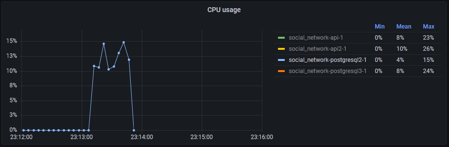
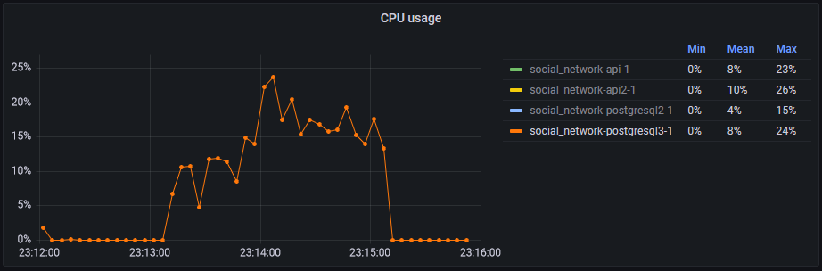
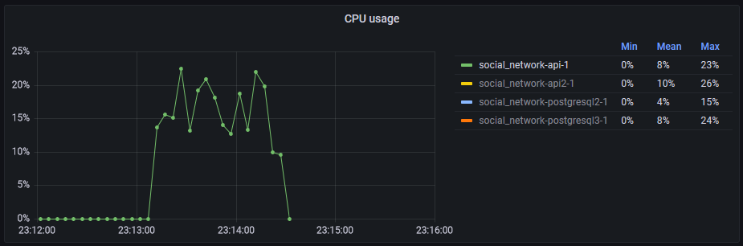
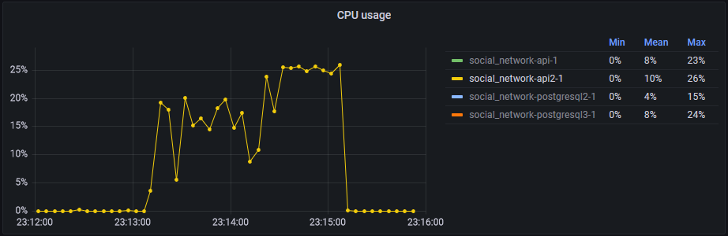
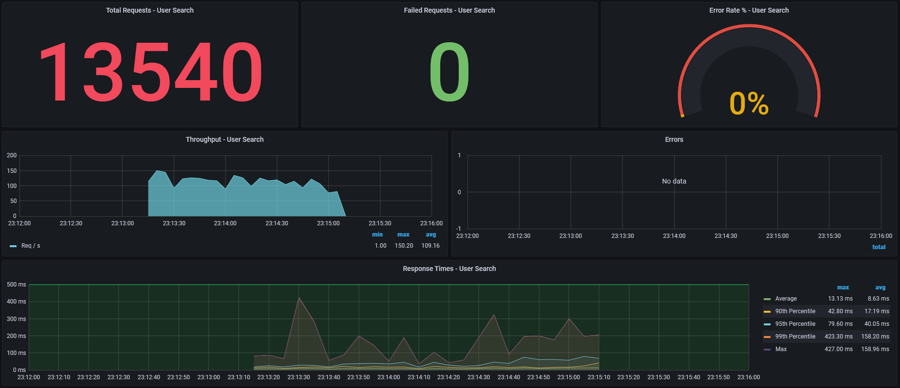

# Отказоустойчивость приложений
## Docker
При остановке контейнеров докер перестаёт резолвить их имена и высвобождает ip-адреса. Это не даёт нормально использовать в haproxy/nginx имена сервисов из docker-compose или статические адреса: будет не резолв имени или отсутсвие маршрута до адреса. Поэтому контейнерам слейвов и приложений был опубликован отдельный порт на хосте, после чего используется связка ip-адрес-хоста:порт для обращения к каждому.

## Слейвы PostgreSQL
Подняты в рамках ДЗ №3 (см. [homework-3-report.md](./homework-3-report.md).
Сконфигурированы в HAProxy как backend о двух серверах (с ip хоста и опубликованными портами) с round robin балансировкой:
```
backend postgresql_slave
    mode tcp
    balance roundrobin
    server slave1 10.0.3.15:55433 check port 55433
    server slave2 10.0.3.15:55434 check port 55434
```

## Приложения
В метод [dbGetUsersByFistAndLastName](../api/database.go) добавлена проверка соединения c БД и реконнект в случае ошибки.
Поднята вторая копия сервиса api. В конфигурации обоих приложений вместо прямого имени сервисов PostgreSQL указан haproxy:
```
POSTGRESQL2_HOST: haproxy
POSTGRESQL2_PORT: 5433
POSTGRESQL3_HOST: haproxy
POSTGRESQL3_PORT: 5433
```
В nginx указаны как два сервера в upstream с round robin (по умолчанию) балансировкой:
```
    upstream api {
        server 10.0.3.15:58080;
        server 10.0.3.15:58081;
    }
```

## Нагрузка
JMeter будет работать в один тред в течение двух минут. Во время теста через 40 секунд будет выключен один слейв PostgreSQL, ещё через 40 секунд будет выключен один сервис api.

Слейв №1 был выключен в 23:13:50:

После чего нагрузка на слейв №2 выросла примерно в 2 раза:


Сервис api был выключен в 23:14:30:

После чего нагрузка утилизация ЦПУ сервисом api2 достигла потолка (cpus: 0.25):


При этом, jmeter не получил ни одной ошибки:

При отключении второго сервиса примерно в два раза вырос response time, т.к. стало в два раза меньше обработчиков запросов.

## Вывод
При использовании балансировщиков система остаётся работоспособной в случае отказа части балансируемых компонент.
